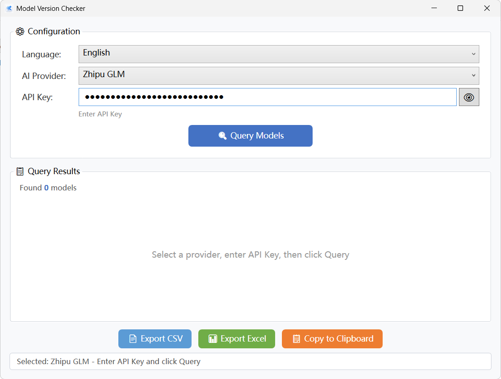

# 🔍 Model Version Checker

A WPF desktop application for querying available AI model versions across multiple providers. Simply select an AI provider, enter your API key, and instantly see all available models.

## ✨ Features

- **11 AI Providers Supported** — OpenAI, Anthropic (Claude), Google Gemini, DeepSeek, Mistral, Groq, Moonshot (Kimi), Zhipu GLM, Alibaba DashScope (Qwen), Baidu Qianfan (ERNIE), Cohere
- **One-Click Query** — Select provider → Enter API Key → Get model list instantly
- **Multi-Language** — English (default) / 中文, switch at any time
- **Export Results** — CSV, Excel (.xlsx), or Copy to Clipboard
- **Secure Input** — API Key masked by default with show/hide toggle
- **Error Handling** — Friendly messages for invalid keys, rate limits, network errors, etc.
- **Single EXE** — Self-contained deployment, no .NET runtime required

## 📸 Screenshot



## 🚀 Quick Start

### Option 1: Download EXE (Recommended)

Download `ModelVersionChecker.exe` from the [Releases](../../releases) page. Double-click to run — no installation needed.

### Option 2: Build from Source

**Prerequisites:** .NET 8 SDK

```bash
git clone https://github.com/smartidle/Model-Version-Checker.git
cd Model-Version-Checker/ModelVersionChecker
dotnet run
```

### Build Single EXE

```bash
dotnet publish -c Release -r win-x64 --self-contained true -p:PublishSingleFile=true -p:IncludeNativeLibrariesForSelfExtract=true -o ./publish
```

## 🏗️ Architecture

```
ModelVersionChecker/
├── Models/                          # Data models & API response DTOs
│   ├── ModelInfo.cs                 # Unified model data
│   ├── ProviderType.cs              # Provider enum (11 providers)
│   ├── ProviderDisplayItem.cs       # ComboBox display item
│   └── ApiResponse/                 # JSON deserialization models
├── Services/                        # Business logic layer
│   ├── IModelProviderService.cs     # Core provider interface
│   ├── OpenAICompatibleProviderService.cs  # Shared by 7 providers
│   ├── AnthropicProviderService.cs         # Anthropic (Claude)
│   ├── GeminiProviderService.cs            # Google Gemini
│   ├── BaiduProviderService.cs             # Baidu Qianfan
│   ├── CohereProviderService.cs            # Cohere
│   ├── ProviderServiceFactory.cs           # Factory pattern
│   ├── LanguageService.cs                  # i18n (EN/ZH)
│   ├── ExportService.cs                    # CSV + Excel export
│   └── IExportService.cs
├── ViewModels/                      # MVVM ViewModel layer
│   ├── MainViewModel.cs
│   └── ModelItemViewModel.cs
├── Views/                           # WPF views
│   ├── MainWindow.xaml
│   └── MainWindow.xaml.cs
├── Converters/                      # WPF value converters
├── Helpers/                         # HttpClient singleton
└── Resources/                       # App icon & styles
```

### Design Highlights

- **One class covers 7 providers** — `OpenAICompatibleProviderService` is parameterized with base URL, shared by OpenAI, DeepSeek, Mistral, Groq, Kimi, Zhipu GLM, and Alibaba DashScope
- **Factory + Interface pattern** — Easy to add new providers with zero modification to existing code
- **CommunityToolkit.Mvvm** — Source generators reduce boilerplate
- **LanguageService** — Centralized i18n with real-time switching

## 🔑 Supported Providers & API Endpoints

| Provider | API Endpoint | Auth Method |
|----------|-------------|-------------|
| OpenAI | `api.openai.com/v1/models` | Bearer Token |
| Anthropic | `api.anthropic.com/v1/models` | x-api-key Header |
| Google Gemini | `generativelanguage.googleapis.com/v1beta/models` | URL Parameter |
| DeepSeek | `api.deepseek.com/v1/models` | Bearer Token |
| Mistral | `api.mistral.ai/v1/models` | Bearer Token |
| Groq | `api.groq.com/openai/v1/models` | Bearer Token |
| Moonshot (Kimi) | `api.moonshot.cn/v1/models` | Bearer Token |
| Zhipu GLM | `open.bigmodel.cn/api/paas/v4/models` | Bearer Token |
| Alibaba DashScope | `dashscope.aliyuncs.com/compatible-mode/v1/models` | Bearer Token |
| Baidu Qianfan | `qianfan.baidubce.com/v2/models` | Bearer Token |
| Cohere | `api.cohere.com/v1/models` | Bearer Token |

## 🛠️ Tech Stack

- **.NET 8** WPF
- **CommunityToolkit.Mvvm** 8.4 — MVVM source generators
- **ClosedXML** — Excel export (MIT license)
- **CsvHelper** — CSV export
- **System.Text.Json** — JSON serialization (built-in)

## 📄 License

MIT License
